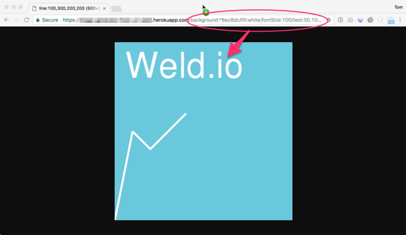

# Image Generator from URL

Service that generates an image, based on input given in an URL.

Made by the team at **Weld** ([www.weld.io](https://www.weld.io?utm_source=github-image-generator-from-url)), the code-free app and web creation tool:

## Screenshot

## How to run it

1. Install GraphicsMagick.
2. Install NPM packages: `npm install`
3. Start with `npm start` (development: `npm run-script dev`)

## How to use it

1. Browser: Open your favorite browser and make an image like this:
`http://localhost:3030/background:pink/text:A+beautiful+golden+sun+is+setting`

2. Embed a an image directly into an HTML page:

	

3. Command line:

	npm start background:pink/text:A+beautiful+golden+sun+is+setting

### Parameters

* Image format: `format:png` (default: 'jpg')
* Image width: `width:500` (default: 400)
* Image height: `height:200` (default: 400)
* Background: `background:#DDAADD` (default: white)
* Draw a line: `rectangle:10px,10px,50%,50%,#DDAADD` (x1, y1, x2, y2, color)
* Draw a rectangle: `rectangle:10px,10px,50%,50%,rgba(0,0,0,0.5)` (x, y, width, height, fillColor, border)
* Draw an ellipse: `ellipse:10px,10px,50%,50%,hlsa(0,0,0,0.5),2px,#DDAADD` (x, y, width, height, fillColor, borderSize, borderColor)
* Draw text: `text:A+beautiful+golden+sun\,+is+setting,10px,10px` (text, x, y, font size, font family, alignment)
* Draw an image: `image:10px,10px,50%,50%,http://server.com/image.png` (x, y, width, height, URL)
